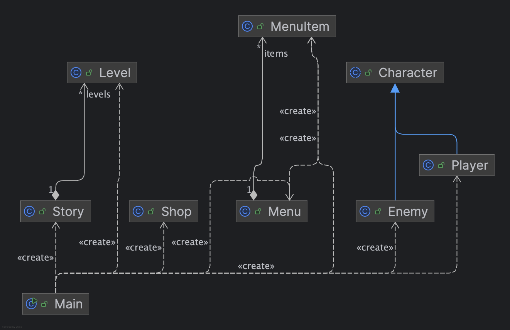

# Projet « RPG »

## État d'avancement

- [x] Système de combat
- [x] Système de repos
- [x] Système d’achats
- [x] Gestion de l'inventaire et de l'équipement
- [x] Génération de la documentation JavaDoc
- [x] Diagramme de classes UML généré
- [x] Diagramme de flux

## Diagramme de classes (UML)

## Diagramme de flux

## Difficultés rencontrées et solutions adoptées

### 1. Gestion du shop et de l’inventaire
- **Problème** : Le menu de la boutique s'ouvrait plusieurs fois ou empêchait le retour au menu principal.
- **Solution** : J'ai modifié la boucle d'achat pour qu'elle se termine correctement après chaque transaction.

### 2. Génération du diagramme UML
- **Problème** : Initialement, seul `Main` apparaissait dans le diagramme.
- **Solution** : J'ai sélectionné manuellement toutes les classes dans IntelliJ IDEA Ultimate pour générer un diagramme complet.

### 3. Problèmes rencontrés avec PlantUML
- **Problème** : Lors de la génération du **diagramme de flux**, j’ai rencontré plusieurs erreurs avec **PlantUML**, notamment :
    - Des erreurs de syntaxe (`Cannot find if`).
    - Des flèches mal reliées aux bonnes étapes.
    - Une difficulté à connecter certaines décisions au bon endroit.
## Bilan des acquis

- Amélioration de la gestion des classes en POO (héritage, polymorphisme, encapsulation).
- Pratique de la documentation avec JavaDoc.
- Génération et intégration de diagrammes UML et de flux.

---

**Dépôt GitHub** : [Repo GIT](https://github.com/flotttt/JavaRPG)
